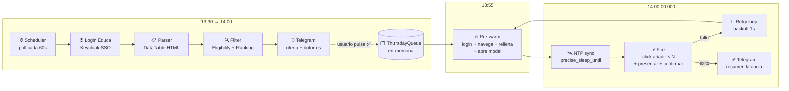

<div align="center">

# 🎓 Navarra Edu Bot

**Automatización inteligente del portal de adjudicación telemática de educación de Navarra**

*Detecta ofertas en tiempo real, te avisa por Telegram y aplica más rápido que cualquier humano.*

[](https://www.python.org/)
[](https://playwright.dev/)
[](https://core.telegram.org/bots)
[](https://www.docker.com/)
[](https://railway.app/)
[](#-aviso-legal)

</div>

---

## 📌 ¿Qué es esto?

El portal de adjudicación de plazas docentes del Gobierno de Navarra publica ofertas entre las **13:30 y las 14:00** cada día laborable. A las **14:00:00 en punto** se abre el plazo para solicitar, y rige una regla brutal: **el primero que solicita, se la lleva**.

Para un humano refrescando F5 manualmente, es una carrera perdida frente a otros candidatos haciendo lo mismo. Este bot resuelve el problema:

1. **Vigila** el portal automáticamente entre 13:30 y 14:00.
2. **Detecta** ofertas nuevas y te las manda a Telegram con **dos botones**: ✅ Aplicar o ❌ Descartar.
3. **Tú decides** desde el móvil con un toque a cuál te interesa.
4. A las **14:00:00.000** sincronizado por NTP, el bot dispara la solicitud con un navegador pre-autenticado y modal pre-cargado, en menos de 1 segundo.
5. Si el portal cae por la avalancha (típico de los jueves), **reintenta sin parar** hasta entrar.

---

## 🎬 Demo

> 📸 *Capturas reales del bot en funcionamiento — añade las tuyas en `docs/images/`*

<div align="center">

| Notificación de oferta | Confirmación al aplicar | Resumen del jueves |
|:---:|:---:|:---:|
|  |  |  |
| Llega a tu Telegram con un toque para aplicar | Tras pulsar **✅ Aplicar**, el bot ejecuta la solicitud | A las 14:00 dispara todas las confirmadas en milisegundos |

</div>

---

## ✨ Funcionalidades

- 🔄 **Polling autónomo** del portal cada minuto entre 13:30 y 14:00.
- 🔐 **Autenticación SSO Keycloak** con la opción "Usuario Educa".
- 🧮 **Filtro inteligente** por:
  - Listas en las que estás `Disponible` (lunes/martes/miércoles/viernes).
  - Especialidades abiertas según tu formación los **jueves** (Tecnología, Matemáticas, Dibujo, Física y Química…).
  - Localidades preferidas (Pamplona, Orkoien/Orcoyen, Barañáin).
- 📊 **Ranking** según preferencias (especialidad > localidad > horas lectivas).
- 📲 **Botones inline** en Telegram para confirmar o descartar con un toque.
- ⚡ **Fast-path para los jueves**:
  - Sincronización **NTP** con el Real Observatorio de la Armada.
  - Pre-warm del navegador 5 minutos antes (login + navegación + relleno de email/teléfono + apertura de modal).
  - Disparo a las `14:00:00.000` con `precise_sleep_until` + busy-spin para minimizar jitter.
  - **Retry infinito** con backoff de 1 s si el portal devuelve 5xx.
- 💾 **Persistencia SQLite** con histórico de ofertas vistas y decisiones.
- 📦 **Dockerizado** y desplegable en Railway con un solo `docker compose up`.
- 🪵 **Logs estructurados** vía `structlog` con métricas de latencia reales (timestamp del click vs. 14:00:00).

---

## 📅 Rutina diaria

El bot vive 24/7 en Railway. Cada día laborable hace lo mismo, pero las **ofertas elegibles** dependen del día de la semana según el reglamento de adjudicación de Navarra:

### Lunes, martes, miércoles y viernes (días "cerrados")

Sólo se ofertan las plazas de las listas en las que el usuario está marcado como **Disponible** (se renueva cada año). En la práctica son las especialidades del cuerpo 0590 (Equipos Electrónicos, Org. Proyectos Fab. Mecánica, Sistemas Electrotécnicos, Sistemas Electrónicos, Tecnología) y del 0598 (Mantenimiento de Vehículos, Carpintería).

### Jueves (día "abierto" para nueva incorporación)

Se abren plazas adicionales a quien acredite formación adecuada aunque no esté en lista. En el caso del titular del bot (Grado + Máster en Ing. Tecnologías Industriales), eso suele incluir: **Tecnología, Matemáticas, Dibujo y Física y Química** del cuerpo 0590. Es el día que **paga la pena** correr — hay competencia real por la oferta y gana el primero que la solicita.

### Línea temporal de un día cualquiera

```
00:00 ─┐
       │  Bot vivo en reposo (~80 MB RAM).
       │  Telegram acepta /status, /queue, /cancel en cualquier momento.
       │
13:25 ─┤
       │  Inicio del ciclo del día:
       │    • Refresh de cookies vía Playwright (10 s, pico ~200 MB).
       │    • Lectura de solicitudes.xhtml para saber qué ya está aplicado.
       │    • Auto-detección del convid activo.
       │
13:30 ─┤  Empieza la ventana de publicación oficial.
       │  Polling HTTP cada 120 s contra areapersonal.xhtml:
       │    • Filtra por elegibilidad del día (Disponible vs. jueves abierto).
       │    • Ordena por preferencia (Tecnología > Matemáticas > Dibujo,
       │      Pamplona > Orkoien > Barañáin > resto, jornada completa primero).
       │    • Manda a Telegram cada oferta nueva con botones ✅ Aplicar / ❌ Descartar.
       │
       │  El usuario va decidiendo desde el móvil:
       │    • L/M/X/V → aplicar dispara la solicitud al instante.
       │    • Jueves  → aplicar añade el offer_id a la cola y espera a las 14:00.
       │
13:55 ─┤
       │  Pre-warm de N navegadores en paralelo (uno por oferta en la cola):
       │    login + navegación a solicitud.xhtml + email/teléfono rellenados +
       │    modal "Elegir ofertas" abierto. Todos en espera.
       │
14:00:00.000 ─┤
       │  Sincronización NTP (Real Observatorio Armada) + busy-spin para
       │  precisión sub-100 ms. Disparo simultáneo de las N solicitudes
       │  vía asyncio.gather. Cada contexto añade su oferta, presenta y confirma.
       │
14:00 ─┤
       │  Verificación post-disparo: GET solicitudes.xhtml y comprobar que
       │  cada oferta disparada figura efectivamente como solicitud presentada.
       │
14:05 ─┤
       │  Heartbeat a Telegram con el resumen del día:
       │    💓 Resumen del ciclo 2026-04-29 14:00
       │    📊 Última poll: 4 ofertas detectadas
       │    📋 Cola al disparo: 2 solicitada(s)
       │    ⚡ Ráfaga: 2 en 0.842 s
       │    ✅ Confirmadas: 121820, 121936
       │
14:06 ─┘
       └─ El loop calcula el target del día siguiente (mañana 14:00) y
          entra en reposo hasta las 13:25 del próximo día laborable.
```

### Sábados y domingos

El portal no publica ofertas, pero el bot sigue vivo. El ciclo dispara a las 14:00 con cola vacía → cero ráfaga → heartbeat anuncia "no había nada en cola — bot vivo y a la espera". Esto sirve también como **canary**: si un sábado no llega heartbeat, sé que algo se ha caído antes de que importe.

### Casos especiales

- **Convocatoria finalizada**: si el portal muestra "Ha finalizado el plazo de participación", el bot detecta la frase, pausa el polling, y te avisa una sola vez para que no spamee errores.
- **Sesión expirada en plena ventana**: el `HttpSession` re-llama a Playwright para reloggear y reanuda el polling sin perder ofertas.
- **Caída del portal a las 14:00 (típico de los jueves)**: cada contexto reintenta hasta 60 veces con backoff de 1 s. El que entra primero, gana.

---

## 🏗 Arquitectura



### Capas

| Capa | Módulo | Responsabilidad |
|---|---|---|
| **Scraper** | `scraper/login.py` | Login SSO Keycloak |
| | `scraper/fetch.py` | Orquesta navegador headless + parser |
| | `scraper/parser.py` | Extrae ofertas del DataTable HTML |
| | `scraper/apply.py` | `prewarm_application_context` + `fire_submission` |
| **Filter** | `filter/eligibility.py` | Reglas día-de-la-semana + listas Disponible |
| | `filter/ranker.py` | Ordena por especialidad → localidad → horas |
| **Telegram** | `telegram_bot/formatter.py` | Mensajes HTML + botones inline |
| | `telegram_bot/callbacks.py` | Routing apply/discard, encolado los jueves |
| **Scheduler** | `scheduler/thursday_queue.py` | Cola async-safe de ofertas confirmadas |
| | `scheduler/ntp_sync.py` | Offset NTP + `precise_sleep_until` |
| | `scheduler/fast_path_worker.py` | Pre-warm + trigger + retry infinito |
| **Storage** | `storage/db.py` | SQLite (offers, decisions) |
| **CLI** | `cli.py` | `ping`, `fetch`, `run-once`, `run-thursday` |

---

## 🚀 Instalación

### Opción A — Docker (recomendado, lo que se usa en Railway)

```bash
git clone https://github.com/vTanco/avarra-edu-bot.git
cd avarra-edu-bot

# Crea tu config.yaml a partir del ejemplo
cp config.example.yaml config.yaml
# (edita config.yaml con tus listas Disponible, localidades, etc.)

# Variables de entorno (en .env o exportadas)
cat > .env << EOF
EDUCA_USERNAME=tu_usuario_educa
EDUCA_PASSWORD=tu_password_educa
TELEGRAM_TOKEN=123456:ABC-DEF...
TELEGRAM_CHAT_ID=123456789
APPLY_EMAIL=tu_email@ejemplo.es           # email para el formulario de solicitud
APPLY_PHONE=600000000                      # teléfono para el formulario de solicitud
# HEALTHCHECK_PING_URL=https://hc-ping.com/<uuid>  # opcional, watchdog externo
EOF

docker compose up -d
docker compose logs -f
```

### Opción B — Local macOS con `uv`

```bash
git clone https://github.com/vTanco/avarra-edu-bot.git
cd avarra-edu-bot

uv venv
uv pip install -e ".[dev]"
uv run playwright install chromium

cp config.example.yaml ~/.navarra-edu-bot/config.yaml
# Edita ~/.navarra-edu-bot/config.yaml

# Guarda credenciales en macOS Keychain (no tocan disco en claro)
security add-generic-password -s navarra-edu-bot -a educa-username -w "tu_usuario"
security add-generic-password -s navarra-edu-bot -a educa-password -w "tu_pass"
security add-generic-password -s navarra-edu-bot -a telegram-token -w "123456:ABC..."
security add-generic-password -s navarra-edu-bot -a telegram-chat-id -w "123456789"

# Healthcheck
uv run navarra-edu-bot ping-telegram
```

### Opción C — Despliegue en Railway

1. Fork del repositorio.
2. Conecta el repo a Railway.
3. Define las variables de entorno (`EDUCA_USERNAME`, `EDUCA_PASSWORD`, `TELEGRAM_TOKEN`, `TELEGRAM_CHAT_ID`, `APPLY_EMAIL`, `APPLY_PHONE`, `TZ=Europe/Madrid`; opcional `HEALTHCHECK_PING_URL`).
4. Railway detecta el `Dockerfile` y construye automáticamente.
5. El comando por defecto es `run-thursday --headless`. Cambia `CMD` en el `Dockerfile` si quieres otro comportamiento.

---

## ⚙️ Configuración

Edita `config.yaml` (o `~/.navarra-edu-bot/config.yaml` en local):

```yaml
user:
  preferred_localities:
    - "Pamplona"
    - "Orkoien"
    - "Barañáin"
  specialty_preference_order:
    - "Tecnología"
    - "Matemáticas"
    - "Dibujo"

# Listas en las que estás Disponible (L/M/X/V abren sólo éstas)
available_lists:
  - body: "0590"
    specialty: "Tecnología"
  - body: "0598"
    specialty: "Mantenimiento de Vehículos"
  # ...

# Listas que se abren los jueves según tu formación
thursday_open_specialties:
  - body: "0590"
    specialty: "Tecnología"
  - body: "0590"
    specialty: "Matemáticas"
  - body: "0590"
    specialty: "Dibujo"
  - body: "0590"
    specialty: "Física y Química"

scheduler:
  daily_start: "13:25"
  daily_end: "14:05"
  poll_interval_seconds: 15
```

> 🔒 **Las credenciales nunca van a `config.yaml`.** Viven en variables de entorno (Docker/Railway) o en macOS Keychain (local).

---

## 🛠 Comandos CLI

| Comando | Descripción |
|---|---|
| `navarra-edu-bot ping` | Healthcheck básico — devuelve `pong`. |
| `navarra-edu-bot ping-telegram` | Envía un mensaje de prueba a tu chat de Telegram. |
| `navarra-edu-bot fetch` | Login + scraping puntual sin notificar. Útil para depurar selectores. |
| `navarra-edu-bot run-once` | Ciclo completo (fetch + filter + notify) **sin** aplicar. Polling de callbacks 60 s. |
| `navarra-edu-bot run-thursday` | Modo carrera: polling 13:30→14:00 + pre-warm + fire @ 14:00:00 + retry. |

Ejemplo:

```bash
# Ejecutar el flujo del jueves (en headless por defecto)
uv run navarra-edu-bot run-thursday

# Modo headed para ver lo que hace el navegador
uv run navarra-edu-bot run-thursday --headed

# Customizar hora objetivo (útil para test fuera de las 14:00 reales)
uv run navarra-edu-bot run-thursday --target-hour 16 --target-minute 30
```

---

## 💬 Comandos de Telegram

Una vez el bot está corriendo, lo controlas desde tu chat de Telegram. Todos los comandos van con barra (`/comando`).

### Acción inmediata (sobre cada oferta)

Cada oferta llega con dos botones inline. Pulsas **uno**:

| Botón | Comportamiento |
|---|---|
| ✅ **Aplicar** | L/M/X/V → aplica al instante. Jueves → encola para disparar a las 14:00:00 con el resto. |
| ❌ **Descartar** | Marca la oferta como descartada para no volver a notificarla. |

### Consulta del estado del bot

| Comando | Qué hace |
|---|---|
| `/status` | Próximo target, hora de la última poll, ofertas en cola, ofertas ya aplicadas hoy, convid activo. |
| `/queue` | Versión corta de `/status`: solo muestra la cola. |
| `/logs [N]` | Últimos `N` eventos del log estructurado (default 10, máx 30). Útil para post-mortem. |

### Modificar el comportamiento del ciclo actual

| Comando | Qué hace |
|---|---|
| `/cancel <offer_id>` | Quita una oferta de la cola del jueves. Útil si te arrepientes antes de las 14:00. |
| `/restart` | Aborta el ciclo en curso y arranca uno nuevo (recalcula el siguiente target a 14:00). |

### Validación / debugging

| Comando | Qué hace |
|---|---|
| `/dryrun` | Fuerza un fetch de ofertas **ahora mismo** (no espera al próximo intervalo) y muestra las elegibles. Comprueba que el portal responde y que el filtro funciona. |
| `/test_apply <offer_id>` | Ejecuta el flujo completo de aplicación con `dry_run=True`: login + navegación + relleno de formulario + clic en "Presentar solicitud" — pero **sin pulsar el confirm final**. Valida que los selectores siguen vivos sin consumir una solicitud real. |

### Mensajes que el bot envía sin pedírselo

| Tipo | Cuándo |
|---|---|
| 📨 Oferta nueva | Cuando detecta una oferta elegible que no había notificado antes. |
| 💓 Heartbeat diario | Tras la ráfaga de las 14:00 (alrededor de las 14:05) con el resumen del ciclo. |
| ⚠️ Polling roto | Tras 3 fallos consecutivos de fetch (una sola vez por incidencia, sin spam). |
| ⚠️ Canary pre-vuelo | Si el canary del inicio del ciclo detecta un problema (selectores, sesión, convocatoria). |
| ⚠️ Convocatoria finalizada | Si el portal indica que el plazo ha terminado. |
| 📦 Backup | Una vez al día, si el chat de Telegram acepta documentos (DB gzip adjunta). |

> 💡 **Tip**: si recibes una alerta de canary o de polling roto, encadena `/dryrun` + `/logs 15` para diagnosticar en 5 segundos sin entrar en Railway.

---

## 📁 Estructura del proyecto

```
navarra-edu-bot/
├── navarra_edu_bot/
│   ├── cli.py                      # Click CLI con todos los comandos
│   ├── config/                     # Pydantic schema + YAML loader + Keychain
│   ├── filter/                     # Eligibility + ranking
│   ├── scheduler/                  # Cola jueves + NTP + fast_path_worker
│   ├── scraper/                    # Login + fetch + parser + apply
│   ├── storage/                    # SQLite models + db
│   └── telegram_bot/               # Cliente + formatter + callbacks
├── tests/                          # Pytest + fixtures HTML reales
├── scripts/                        # Capturadores y dry-run scripts
├── docs/
│   ├── superpowers/specs/          # Spec de diseño (brainstorming)
│   ├── superpowers/plans/          # Planes de implementación TDD
│   └── images/                     # Capturas para README
├── deploy/                         # launchd plist (alternativa a Docker)
├── Dockerfile
├── docker-compose.yml
├── config.example.yaml
└── pyproject.toml
```

---

## 🧪 Tests

```bash
uv run pytest -v
```

Los tests usan fixtures HTML reales capturadas del portal en `tests/fixtures/`. Cubren parser, filter, ranking, storage, callbacks y el worker fast-path con mocks de Playwright.

---

## 📚 Documentación adicional

- **[Spec de diseño](docs/superpowers/specs/2026-04-22-navarra-edu-bot-design.md)** — arquitectura completa, decisiones, riesgos.
- **[Plan Fases 0-2](docs/superpowers/plans/2026-04-22-navarra-edu-bot-phases-0-2.md)** — scaffolding, scraper, filter, Telegram.
- **[Plan Fase 4 fast-path](docs/superpowers/plans/2026-04-23-fase-4-fast-path-jueves.md)** — la carrera del jueves paso a paso.

---

## ⚠️ Aviso legal

Este proyecto es **de uso personal**, desarrollado para automatizar las gestiones de un único candidato titular del bot. No es un servicio compartido ni un producto comercial.

- Las credenciales de Educa son personales e intransferibles. **No las compartas.**
- El bot no realiza ninguna acción que un humano no pueda hacer manualmente desde la web; sólo lo hace más rápido y de forma desatendida.
- El uso es responsabilidad de cada usuario; el autor no responde por bloqueos de cuenta, sanciones administrativas u otros perjuicios derivados del uso del bot.
- Si el portal del Gobierno de Navarra cambia su política de uso o introduce captchas, el bot puede dejar de funcionar y deberá ajustarse manualmente.

---

<div align="center">

Hecho con ☕ y mucho `playwright` por **Vicente Tanco Aguas**

</div>
