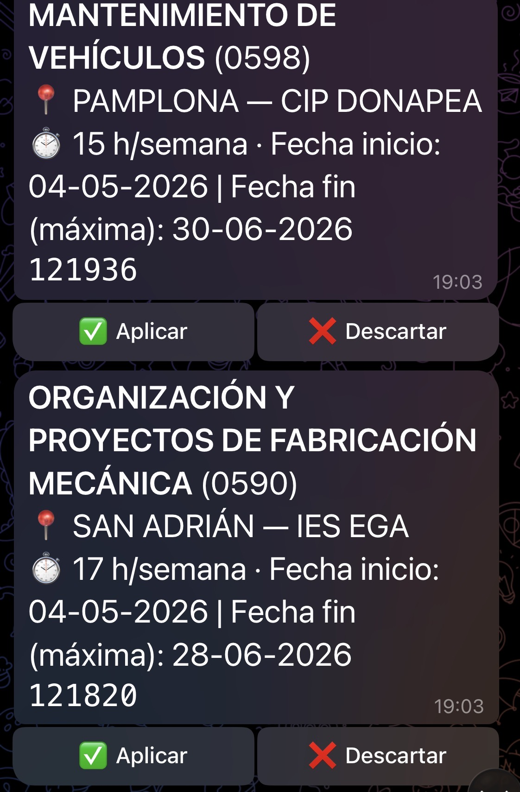
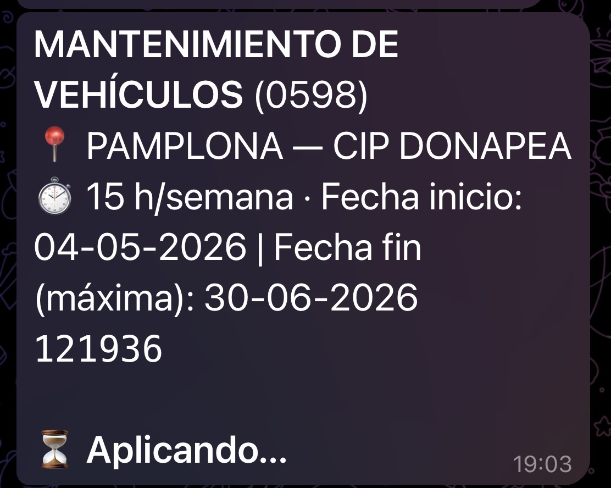
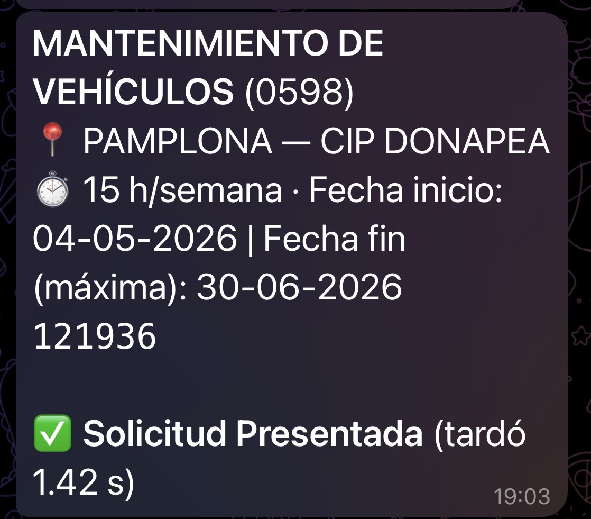
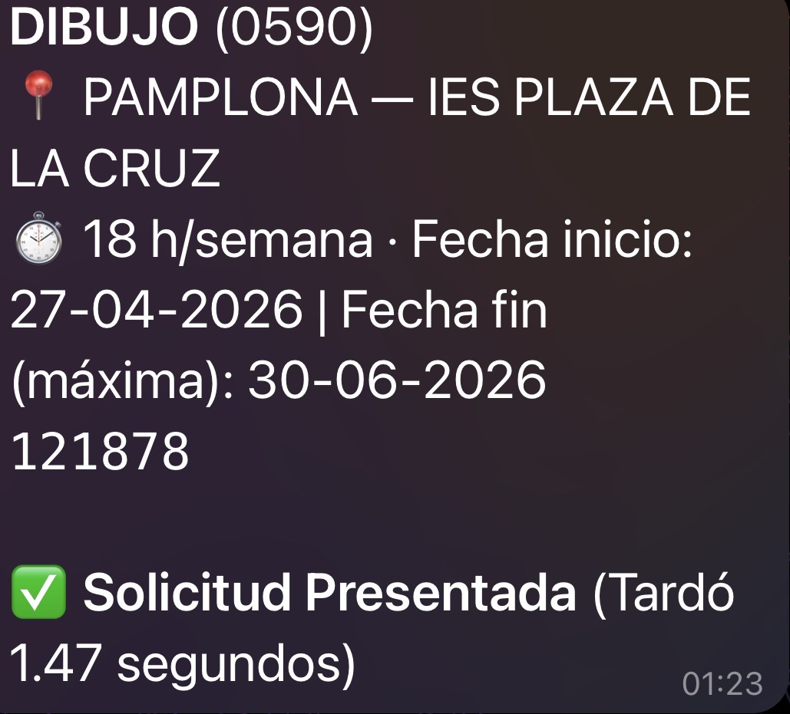
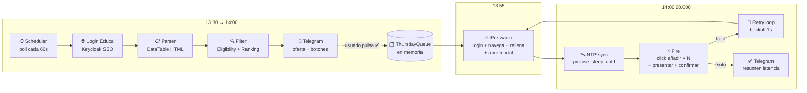

<div align="center">

# 🎓 Navarra Edu Bot

**Automatización inteligente del portal de adjudicación telemática de educación de Navarra**

*Detecta ofertas en tiempo real, te avisa por Telegram y aplica más rápido que cualquier humano.*

[](https://www.python.org/)
[](https://playwright.dev/)
[](https://core.telegram.org/bots)
[](https://www.docker.com/)
[](https://railway.app/)
[](#-tests)
[](https://github.com/vTanco/avarra-edu-bot)
[](#%EF%B8%8F-aviso-legal)

</div>

> ⚠️ **Bot de uso personal.** Este código existe para automatizar las gestiones de **un único candidato** (yo). No es un producto, no es un servicio compartido, y nadie debería usar mis credenciales. El portal de Navarra puede cambiar y romperlo; las cuentas pueden ser bloqueadas si se abusa. Si quieres adaptarlo para ti, fork → cambia config + credenciales → asume tú la responsabilidad.

---

## 📑 Índice

1. [¿Qué es esto?](#-qué-es-esto)
2. [Demo en 4 pasos](#-demo)
3. [Quick Start](#-quick-start)
4. [Funcionalidades](#-funcionalidades)
5. [Rutina diaria](#-rutina-diaria)
6. [Arquitectura](#-arquitectura)
7. [Stack y por qué](#-stack-y-por-qué)
8. [Instalación detallada](#-instalación)
9. [Configuración](#%EF%B8%8F-configuración)
10. [Comandos CLI](#-comandos-cli)
11. [Comandos de Telegram](#-comandos-de-telegram)
12. [FAQ](#-faq)
13. [Estructura del proyecto](#-estructura-del-proyecto)
14. [Tests](#-tests)
15. [Documentación adicional](#-documentación-adicional)
16. [Aviso legal](#%EF%B8%8F-aviso-legal)

---

## 📌 ¿Qué es esto?

El portal de adjudicación de plazas docentes del Gobierno de Navarra publica ofertas entre las **13:30 y las 14:00** cada día laborable. A las **14:00:00 en punto** se abre el plazo para solicitar, y rige una regla brutal: **el primero que solicita, se la lleva**.

Para un humano refrescando F5 manualmente, es una carrera perdida frente a otros candidatos haciendo lo mismo. Este bot resuelve el problema:

1. **Vigila** el portal automáticamente entre 13:30 y 14:00.
2. **Detecta** ofertas nuevas y te las manda a Telegram con **dos botones**: ✅ Aplicar o ❌ Descartar.
3. **Tú decides** desde el móvil con un toque a cuál te interesa.
4. A las **14:00:00.000** sincronizado por NTP, el bot dispara la solicitud con un navegador pre-autenticado y modal pre-cargado, en menos de 1 segundo.
5. Si el portal cae por la avalancha (típico de los jueves), **reintenta sin parar** hasta entrar.

### F5 manual vs. Navarra Edu Bot

| Tarea | F5 manual | Navarra Edu Bot |
|---|---|---|
| Vigilar el portal 13:30 – 14:00 | Refrescar a mano cada pocos segundos | Polling HTTP automático cada 120 s |
| Filtrar ofertas | Mental, error humano | Filtro determinista por listas + localidad + jornada |
| Decidir cuál aplicar | Lectura rápida bajo presión | Telegram con botones, decides relajado |
| Ejecutar a las 14:00:00 | F5 + 5 clics + scroll | NTP-sync + busy-spin + N solicitudes en paralelo |
| Latencia clic-a-confirmación | 5–15 s en el mejor caso | **~1.4 s end-to-end** medidos |
| Si el portal cae | Refrescar y rezar | Retry con backoff hasta entrar |
| Funciona estando dormido | No | Sí |

---

## ⚡ Quick Start

```bash
# 1. Clona el repo
git clone https://github.com/vTanco/avarra-edu-bot.git && cd avarra-edu-bot

# 2. Crea tu config y .env (sustituye los valores)
cp config.example.yaml config.yaml
cat > .env << EOF
EDUCA_USERNAME=tu_usuario
EDUCA_PASSWORD=tu_password
TELEGRAM_TOKEN=123456:ABC...
TELEGRAM_CHAT_ID=123456789
APPLY_EMAIL=tu_email@ejemplo.es
APPLY_PHONE=600000000
EOF

# 3. Arranca
docker compose up -d
```

En menos de un minuto deberías ver `pong` al ejecutar `/status` desde tu chat de Telegram. Si quieres detalles, sigue leyendo. Si quieres desplegar en Railway sin máquina propia, salta a [Instalación](#-instalación).

---

## 🎬 Demo

Capturas reales del bot en funcionamiento. El flujo de extremo a extremo en cuatro pasos:

<div align="center">

### 1. Llegan las ofertas elegibles con dos botones



*Cada oferta llega como un mensaje aparte con su título, localidad, centro, jornada y fechas. Pulsas un botón con el pulgar.*

### 2. Pulsas ✅ Aplicar y el bot empieza a ejecutar



*El mensaje se edita al instante para confirmar que el bot ha cogido la orden y está aplicando.*

### 3. Solicitud presentada con latencia real medida



*El bot reporta el tiempo desde el clic hasta que el portal acepta la solicitud (~1.4 s end-to-end).*

### 4. Otro apply en otra especialidad — el flujo es el mismo



*Ya sea Tecnología, Matemáticas, Dibujo o Mantenimiento de Vehículos, el flujo y el tiempo son consistentes.*

</div>

---

## ✨ Funcionalidades

- 🔄 **Polling autónomo** del portal cada minuto entre 13:30 y 14:00.
- 🔐 **Autenticación SSO Keycloak** con la opción "Usuario Educa".
- 🧮 **Filtro inteligente** por:
  - Listas en las que estás `Disponible` (lunes/martes/miércoles/viernes).
  - Especialidades abiertas según tu formación los **jueves** (Tecnología, Matemáticas, Dibujo, Física y Química…).
  - Localidades preferidas (Pamplona, Orkoien/Orcoyen, Barañáin).
- 📊 **Ranking** según preferencias (especialidad > localidad > horas lectivas).
- 📲 **Botones inline** en Telegram para confirmar o descartar con un toque.
- ⚡ **Fast-path para los jueves**:
  - Sincronización **NTP** con el Real Observatorio de la Armada.
  - Pre-warm del navegador 5 minutos antes (login + navegación + relleno de email/teléfono + apertura de modal).
  - Disparo a las `14:00:00.000` con `precise_sleep_until` + busy-spin para minimizar jitter.
  - **Retry infinito** con backoff de 1 s si el portal devuelve 5xx.
- 💾 **Persistencia SQLite** con histórico de ofertas vistas y decisiones.
- 📦 **Dockerizado** y desplegable en Railway con un solo `docker compose up`.
- 🪵 **Logs estructurados** vía `structlog` con métricas de latencia reales (timestamp del click vs. 14:00:00).

---

## 📅 Rutina diaria

El bot vive 24/7 en Railway. Cada día laborable hace lo mismo, pero las **ofertas elegibles** dependen del día de la semana según el reglamento de adjudicación de Navarra:

### Lunes, martes, miércoles y viernes (días "cerrados")

Sólo se ofertan las plazas de las listas en las que el usuario está marcado como **Disponible** (se renueva cada año). En la práctica son las especialidades del cuerpo 0590 (Equipos Electrónicos, Org. Proyectos Fab. Mecánica, Sistemas Electrotécnicos, Sistemas Electrónicos, Tecnología) y del 0598 (Mantenimiento de Vehículos, Carpintería).

### Jueves (día "abierto" para nueva incorporación)

Se abren plazas adicionales a quien acredite formación adecuada aunque no esté en lista. En el caso del titular del bot (Grado + Máster en Ing. Tecnologías Industriales), eso suele incluir: **Tecnología, Matemáticas, Dibujo y Física y Química** del cuerpo 0590. Es el día que **paga la pena** correr — hay competencia real por la oferta y gana el primero que la solicita.

### Línea temporal de un día cualquiera

```mermaid
timeline
    title Día normal del Navarra Edu Bot
    00:00 — 13:24 : Bot vivo en reposo (~80 MB RAM)
                  : Acepta /help /status /health en cualquier momento
    13:25 : Inicio del ciclo
          : Refresh cookies vía Playwright (10 s, pico ~200 MB)
          : Lee solicitudes ya aplicadas
          : Auto-detecta convid activo
    13:30 — 13:55 : Polling HTTP cada 120 s
                  : Filtra elegibles (Disponible / jueves abierto)
                  : Ranking por preferencia
                  : Telegram con botones por cada oferta
    13:55 : Pre-warm en paralelo
          : N navegadores con login + nav + fill + modal abierto
    14·00·00 : Fire NTP-sincronizado
             : asyncio.gather de N solicitudes simultáneas
    14:05 : Heartbeat a Telegram
          : Verificación post-disparo
          : Backup gzip diario
    14:06 — siguiente día : Reposo hasta las 13:25 del próximo día
```

#### Ejemplo de heartbeat al final del ciclo

```text
💓 Resumen del ciclo 2026-04-29 14:00
📊 Última poll: 4 ofertas detectadas
📋 Cola al disparo: 2 solicitada(s)
⚡ Ráfaga: 2 en 0.842 s
✅ Confirmadas en solicitudes: 121820, 121936
```

#### Ejemplo de log estructurado (`/logs 5`)

```text
ℹ️ 13:30:14  poll_ok       {"fetched": 0, "sent": 0, "convid": null}
ℹ️ 13:32:14  poll_ok       {"fetched": 3, "sent": 2, "convid": "1207"}
ℹ️ 13:55:01  cycle_start   {"target": "2026-04-29T14:00:00"}
ℹ️ 14:00:01  fast_path_done{"submitted": ["121820","121936"], "elapsed_s": 0.842}
ℹ️ 14:00:02  manual_poll   {"fetched": 3, "eligible": 2, "sent": 2}
```

### Sábados y domingos

El portal no publica ofertas, pero el bot sigue vivo. El ciclo dispara a las 14:00 con cola vacía → cero ráfaga → heartbeat anuncia "no había nada en cola — bot vivo y a la espera". Esto sirve también como **canary**: si un sábado no llega heartbeat, sé que algo se ha caído antes de que importe.

### Casos especiales

- **Convocatoria finalizada**: si el portal muestra "Ha finalizado el plazo de participación", el bot detecta la frase, pausa el polling, y te avisa una sola vez para que no spamee errores.
- **Sesión expirada en plena ventana**: el `HttpSession` re-llama a Playwright para reloggear y reanuda el polling sin perder ofertas.
- **Caída del portal a las 14:00 (típico de los jueves)**: cada contexto reintenta hasta 60 veces con backoff de 1 s. El que entra primero, gana.

---

## 🏗 Arquitectura



### Capas

| Capa | Módulo | Responsabilidad |
|---|---|---|
| **Scraper** | `scraper/login.py` | Login SSO Keycloak |
| | `scraper/fetch.py` | Orquesta navegador headless + parser |
| | `scraper/parser.py` | Extrae ofertas del DataTable HTML |
| | `scraper/apply.py` | `prewarm_application_context` + `fire_submission` |
| **Filter** | `filter/eligibility.py` | Reglas día-de-la-semana + listas Disponible |
| | `filter/ranker.py` | Ordena por especialidad → localidad → horas |
| **Telegram** | `telegram_bot/formatter.py` | Mensajes HTML + botones inline |
| | `telegram_bot/callbacks.py` | Routing apply/discard, encolado los jueves |
| **Scheduler** | `scheduler/thursday_queue.py` | Cola async-safe de ofertas confirmadas |
| | `scheduler/ntp_sync.py` | Offset NTP + `precise_sleep_until` |
| | `scheduler/fast_path_worker.py` | Pre-warm + trigger + retry infinito |
| **Storage** | `storage/db.py` | SQLite (offers, decisions) |
| **CLI** | `cli.py` | `ping`, `fetch`, `run-once`, `run-thursday` |

---

## 🧱 Stack y por qué

| Pieza | Por qué se eligió |
|---|---|
| **Python 3.12 + uv** | El portal y los selectores cambian; Python permite iterar rápido. `uv` ofrece dependencias reproducibles 10× más rápido que `pip`. |
| **Playwright (Chromium headless)** | El portal usa JSF + AJAX + Keycloak SSO. Las herramientas HTTP puras tropiezan con tokens y JS; Playwright entiende todo. Sólo se usa para login y la ráfaga; el polling normal va por HTTP plano para ahorrar memoria. |
| **aiohttp** | Polling cada 120 s con cookies extraídas de Playwright: ~50 MB en lugar de los 200 MB que costaría lanzar Chromium. |
| **python-telegram-bot v21 (asyncio)** | Botones inline + comandos sin servidor web propio. Telegram absorbe la capa de UI gratis. |
| **SQLite vía `sqlite3` stdlib** | No hace falta servidor de DB. El estado del bot cabe en menos de un MB. Backup = `cp + gzip`. |
| **Pydantic v2** | Validación estricta del `config.yaml` al arrancar — un typo en una lista o localidad falla rápido en lugar de provocar 0 ofertas detectadas en silencio. |
| **structlog + tabla `events`** | Logs JSON-friendly + histórico consultable desde Telegram con `/logs`. |
| **ntplib (multi-fuente)** | Mediana de 3 servidores NTP para la sincronización a las 14:00:00 sub-100 ms. |
| **Docker + Railway** | El plan Hobby de Railway ($5/mes) basta para un contenedor 24/7. Dockerfile estándar = portable a cualquier otro PaaS sin cambios. |
| **pytest + pytest-asyncio** | 84 tests con fixtures HTML reales del portal. Refactors sin miedo. |

---

## 🚀 Instalación

### Opción A — Docker (recomendado, lo que se usa en Railway)

```bash
git clone https://github.com/vTanco/avarra-edu-bot.git
cd avarra-edu-bot

# Crea tu config.yaml a partir del ejemplo
cp config.example.yaml config.yaml
# (edita config.yaml con tus listas Disponible, localidades, etc.)

# Variables de entorno (en .env o exportadas)
cat > .env << EOF
EDUCA_USERNAME=tu_usuario_educa
EDUCA_PASSWORD=tu_password_educa
TELEGRAM_TOKEN=123456:ABC-DEF...
TELEGRAM_CHAT_ID=123456789
APPLY_EMAIL=tu_email@ejemplo.es           # email para el formulario de solicitud
APPLY_PHONE=600000000                      # teléfono para el formulario de solicitud
# HEALTHCHECK_PING_URL=https://hc-ping.com/<uuid>  # opcional, watchdog externo
EOF

docker compose up -d
docker compose logs -f
```

### Opción B — Local macOS con `uv`

```bash
git clone https://github.com/vTanco/avarra-edu-bot.git
cd avarra-edu-bot

uv venv
uv pip install -e ".[dev]"
uv run playwright install chromium

cp config.example.yaml ~/.navarra-edu-bot/config.yaml
# Edita ~/.navarra-edu-bot/config.yaml

# Guarda credenciales en macOS Keychain (no tocan disco en claro)
security add-generic-password -s navarra-edu-bot -a educa-username -w "tu_usuario"
security add-generic-password -s navarra-edu-bot -a educa-password -w "tu_pass"
security add-generic-password -s navarra-edu-bot -a telegram-token -w "123456:ABC..."
security add-generic-password -s navarra-edu-bot -a telegram-chat-id -w "123456789"

# Healthcheck
uv run navarra-edu-bot ping-telegram
```

### Opción C — Despliegue en Railway

1. Fork del repositorio.
2. Conecta el repo a Railway.
3. Define las variables de entorno (`EDUCA_USERNAME`, `EDUCA_PASSWORD`, `TELEGRAM_TOKEN`, `TELEGRAM_CHAT_ID`, `APPLY_EMAIL`, `APPLY_PHONE`, `TZ=Europe/Madrid`; opcional `HEALTHCHECK_PING_URL`).
4. Railway detecta el `Dockerfile` y construye automáticamente.
5. El comando por defecto es `run-thursday --headless`. Cambia `CMD` en el `Dockerfile` si quieres otro comportamiento.

---

## ⚙️ Configuración

Edita `config.yaml` (o `~/.navarra-edu-bot/config.yaml` en local):

```yaml
user:
  preferred_localities:
    - "Pamplona"
    - "Orkoien"
    - "Barañáin"
  specialty_preference_order:
    - "Tecnología"
    - "Matemáticas"
    - "Dibujo"

# Listas en las que estás Disponible (L/M/X/V abren sólo éstas)
available_lists:
  - body: "0590"
    specialty: "Tecnología"
  - body: "0598"
    specialty: "Mantenimiento de Vehículos"
  # ...

# Listas que se abren los jueves según tu formación
thursday_open_specialties:
  - body: "0590"
    specialty: "Tecnología"
  - body: "0590"
    specialty: "Matemáticas"
  - body: "0590"
    specialty: "Dibujo"
  - body: "0590"
    specialty: "Física y Química"

scheduler:
  daily_start: "13:25"
  daily_end: "14:05"
  poll_interval_seconds: 15
```

> 🔒 **Las credenciales nunca van a `config.yaml`.** Viven en variables de entorno (Docker/Railway) o en macOS Keychain (local).

---

## 🛠 Comandos CLI

| Comando | Descripción |
|---|---|
| `navarra-edu-bot ping` | Healthcheck básico — devuelve `pong`. |
| `navarra-edu-bot ping-telegram` | Envía un mensaje de prueba a tu chat de Telegram. |
| `navarra-edu-bot fetch` | Login + scraping puntual sin notificar. Útil para depurar selectores. |
| `navarra-edu-bot run-once` | Ciclo completo (fetch + filter + notify) **sin** aplicar. Polling de callbacks 60 s. |
| `navarra-edu-bot run-thursday` | Modo carrera: polling 13:30→14:00 + pre-warm + fire @ 14:00:00 + retry. |

Ejemplo:

```bash
# Ejecutar el flujo del jueves (en headless por defecto)
uv run navarra-edu-bot run-thursday

# Modo headed para ver lo que hace el navegador
uv run navarra-edu-bot run-thursday --headed

# Customizar hora objetivo (útil para test fuera de las 14:00 reales)
uv run navarra-edu-bot run-thursday --target-hour 16 --target-minute 30
```

---

## 💬 Comandos de Telegram

Una vez el bot está corriendo, lo controlas desde tu chat de Telegram. Todos los comandos van con barra (`/comando`).

### Acción inmediata (sobre cada oferta)

Cada oferta llega con dos botones inline. Pulsas **uno**:

| Botón | Comportamiento |
|---|---|
| ✅ **Aplicar** | L/M/X/V → aplica al instante. Jueves → encola para disparar a las 14:00:00 con el resto. |
| ❌ **Descartar** | Marca la oferta como descartada. Si estaba en la cola del jueves, también la saca de ella. |

También puedes hacer lo mismo por comando si ya no encuentras el mensaje original:

| Comando | Qué hace |
|---|---|
| `/apply <offer_id>` | Versión por comando del botón ✅ Aplicar. |
| `/discard <offer_id>` | Versión por comando del botón ❌ Descartar. |
| `/offer <offer_id>` | Reenvía una oferta concreta con botones frescos y su estado actual. |
| `/today` | Reenvía **todas** las ofertas vistas hoy con botones, incluso si ya estaban descartadas o aplicadas. |

### Consulta del estado del bot

| Comando | Qué hace |
|---|---|
| `/help` | Resumen corto de todos los comandos disponibles en Telegram. |
| `/status` | Próximo target, última poll, cola, aplicadas hoy, convid activo y si está pausado o silenciado. |
| `/next` | Próximo target, hora de prewarm, próxima poll estimada y cuenta atrás. |
| `/health` | Snapshot de salud: última poll, tamaño de cola, edad de cookies, último error, healthcheck externo. |
| `/queue` | Versión corta de `/status`: solo muestra la cola. |
| `/history [N]` | Últimas decisiones `aplicar/descartar` guardadas en SQLite. |
| `/filters` | Filtros activos: localidades preferidas, orden de especialidades y listas válidas. |
| `/logs [N]` | Últimos `N` eventos del log estructurado (default 10, máx 30). Útil para post-mortem. |

### Modificar el comportamiento del ciclo actual

| Comando | Qué hace |
|---|---|
| `/cancel <offer_id>` | Quita una oferta de la cola del jueves. Útil si te arrepientes antes de las 14:00. |
| `/pause` | Pone el bot en pausa: sigue vivo, pero no notifica ni dispara solicitudes. |
| `/resume` | Reanuda el bot y quita cualquier silencio temporal activo. |
| `/mute [minutos]` | Silencia avisos de Telegram durante un rato, sin tumbar el proceso. |
| `/mute_until HH:MM` | Silencia avisos hasta una hora concreta. |
| `/restart` | Aborta el ciclo en curso y arranca uno nuevo (recalcula el siguiente target a 14:00). |

### Validación / debugging

| Comando | Qué hace |
|---|---|
| `/poll` | Fuerza una poll completa **ahora mismo** y te manda **todas las ofertas elegibles** con sus botones ✅/❌, incluyendo las que ya aplicaste o descartaste antes. Ignora pausa/silencio. Útil para re-evaluar el listado completo cuando ha terminado el polling automático (después de las 14:00). |
| `/dryrun` | Como `/poll` pero **solo muestra el listado** sin enviar las ofertas con botones. Validación rápida de que el portal responde y se parsea bien. |
| `/test_apply <offer_id>` | Ejecuta el flujo completo de aplicación con `dry_run=True`: login + navegación + relleno de formulario + clic en "Presentar solicitud" — pero **sin pulsar el confirm final**. Valida que los selectores siguen vivos sin consumir una solicitud real. |

### Mensajes que el bot envía sin pedírselo

| Tipo | Cuándo |
|---|---|
| 📨 Oferta nueva | Cuando detecta una oferta elegible que no había notificado antes y el bot no está silenciado o en pausa. |
| 💓 Heartbeat diario | Tras la ráfaga de las 14:00 (alrededor de las 14:05) con el resumen del ciclo. |
| ⚠️ Polling roto | Tras 3 fallos consecutivos de fetch (una sola vez por incidencia, sin spam). |
| ⚠️ Canary pre-vuelo | Si el canary del inicio del ciclo detecta un problema (selectores, sesión, convocatoria). |
| ⚠️ Convocatoria finalizada | Si el portal indica que el plazo ha terminado. |
| 📦 Backup | Una vez al día, si el chat de Telegram acepta documentos (DB gzip adjunta). |

> 💡 **Tip**: si has silenciado avisos con `/mute`, luego puedes usar `/today` para recuperar de golpe todas las ofertas del día con botones frescos.
>
> 💡 **Tip**: si recibes una alerta de canary o de polling roto, encadena `/health` + `/dryrun` + `/logs 15` para diagnosticar en 10 segundos sin entrar en Railway.

---

## ❓ FAQ

<details>
<summary><b>¿Esto es legal? ¿Me pueden bloquear la cuenta?</b></summary>

El bot **no realiza ninguna acción que un humano no pueda hacer manualmente** desde el portal — sólo navega, rellena formularios y pulsa botones igual que harías tú. No usa APIs no documentadas, no salta captchas (no hay), no falsifica IPs.

Dicho esto: el reglamento de adjudicación no autoriza explícitamente automatización, así que el riesgo formal existe. Reduce ese riesgo:

- Polling razonable (cada 120 s, no cada segundo).
- Sólo aplica a ofertas para las que **tú serías elegible manualmente**.
- Tú confirmas cada solicitud con un toque — no es un bot que decida solo.

Si Educación de Navarra cambia su política o introduce captchas, el bot fallará y habrá que decidir.
</details>

<details>
<summary><b>¿Funciona para otro candidato distinto de ti?</b></summary>

Sí, pero hay que adaptar el `config.yaml` a tus listas Disponible y especialidades del jueves, y poner tus credenciales en las env vars. El código no tiene nada hardcodeado de mi caso particular tras el commit `chore: move PII out of source`. Sigue [Quick Start](#-quick-start) sustituyendo los valores y deberías estar listo en 15 minutos.

Importante: cada usuario debe correr **su propia instancia**. No comparto la mía.
</details>

<details>
<summary><b>¿Qué pasa cuando cambia la convocatoria?</b></summary>

El portal expone un parámetro `convid=NNNN` en los enlaces de "Solicitar". El bot detecta automáticamente el convid activo en cada poll (`discover_active_convid`) y lo usa para construir la URL de aplicación. Cuando Educación cambia de convocatoria (1206 → 1207, etc.), el bot se entera en el siguiente fetch y se ajusta solo. **No hay que tocar código.**

Si la convocatoria cierra del todo (página "Ha finalizado el plazo de participación"), el bot detecta la frase, pausa el polling, y avisa a Telegram una vez sin spamear errores hasta que se publique la siguiente convocatoria.
</details>

<details>
<summary><b>¿Por qué Railway y no mi Mac con launchd?</b></summary>

Mi Mac portátil no está despierto a las 13:55 todos los días (clases, viajes, batería). Railway tiene un contenedor 24/7 conectado por fibra al backbone de internet. Latencia de ~150-200 ms a Navarra, suficiente para llegar antes que la mayoría.

Si tienes un Mac mini siempre encendido o un servidor casero, hay un `deploy/navarra-edu-bot.plist.template` para launchd. La latencia desde una conexión doméstica española puede ser **mejor** que la de Railway.
</details>

<details>
<summary><b>¿Cuánto cuesta tenerlo en Railway?</b></summary>

Plan **Hobby** de Railway: ~$5/mes. El contenedor consume:
- ~80 MB RAM en reposo
- ~250 MB de pico durante la ráfaga
- ~150 MB de pico durante el refresh diario de cookies

Sobre los 8 GB de RAM y 8 vCPU del plan Hobby es totalmente desproporcionado, pero es el plan más barato que permite volúmenes persistentes.
</details>

<details>
<summary><b>¿El bot decide por mí, o sólo aplico yo?</b></summary>

**Sólo tú decides.** El bot:

1. Te notifica las ofertas elegibles con dos botones.
2. Espera tu pulgar en `✅ Aplicar` o `❌ Descartar`.
3. Sólo entonces ejecuta la solicitud.

Excepción: en jueves, si pulsas `✅ Aplicar` antes de las 14:00, la oferta se encola y se dispara automáticamente a las 14:00:00.000. Sigue siendo decisión tuya — el bot solo retrasa la ejecución para optimizar la latencia de la carrera.
</details>

<details>
<summary><b>¿Y si quiero parar el bot un día concreto?</b></summary>

`/pause` desde Telegram lo silencia hasta nuevo aviso. `/mute 60` silencia 60 minutos. `/resume` lo despierta. El proceso sigue vivo en Railway (no se desconecta) — sólo deja de notificar y de aplicar.
</details>

<details>
<summary><b>¿Cómo me entero de que algo va mal?</b></summary>

Tres capas de detección:

1. **Heartbeat diario** a las 14:05 con resumen del ciclo. Si no llega → algo se rompió.
2. **Alerta tras 3 polls fallidos** consecutivos (una sola alerta por incidencia, sin spam).
3. **Healthchecks.io** opcional (ENV var `HEALTHCHECK_PING_URL`): pinga antes y después de la ráfaga; si falla, te llega email.

Para diagnóstico rápido: `/logs 15` + `/dryrun` desde Telegram, sin entrar en Railway.
</details>

---

## 📁 Estructura del proyecto

```
navarra-edu-bot/
├── navarra_edu_bot/
│   ├── cli.py                      # Click CLI con todos los comandos
│   ├── config/                     # Pydantic schema + YAML loader + Keychain
│   ├── filter/                     # Eligibility + ranking
│   ├── scheduler/                  # Cola jueves + NTP + fast_path_worker
│   ├── scraper/                    # Login + fetch + parser + apply
│   ├── storage/                    # SQLite models + db
│   └── telegram_bot/               # Cliente + formatter + callbacks
├── tests/                          # Pytest + fixtures HTML reales
├── scripts/                        # Capturadores y dry-run scripts
├── docs/
│   ├── superpowers/specs/          # Spec de diseño (brainstorming)
│   ├── superpowers/plans/          # Planes de implementación TDD
│   └── images/                     # Capturas para README
├── deploy/                         # launchd plist (alternativa a Docker)
├── Dockerfile
├── docker-compose.yml
├── config.example.yaml
└── pyproject.toml
```

---

## 🧪 Tests

```bash
uv run pytest -q
# 84 passed in <1 s
```

Los tests usan fixtures HTML reales capturadas del portal en `tests/fixtures/`. Cubren parser, filter, ranking, storage (offers + decisions + events + kv_state), orchestrator, telegram callbacks, scheduler, http_session, NTP multi-fuente y el worker fast-path con mocks de Playwright.

| Capa | Tests |
|---|---|
| `tests/test_scraper_parser.py`, `tests/test_parser_extras.py` | 14 |
| `tests/test_storage*.py` | 12 |
| `tests/test_orchestrator.py` | 3 |
| `tests/test_filter_*.py` | 11 |
| `tests/test_telegram_*.py` | 11 |
| `tests/test_thursday_queue.py` | 5 |
| `tests/test_fast_path_worker.py` | 4 |
| `tests/test_ntp*.py` | 7 |
| `tests/test_diagnostics.py` | 10 |
| `tests/test_config_*.py`, `tests/test_keychain.py` | 7 |

Total: **84 tests, ~1 s de tiempo de ejecución**.

---

## 📚 Documentación adicional

- **[Spec de diseño](docs/superpowers/specs/2026-04-22-navarra-edu-bot-design.md)** — arquitectura completa, decisiones, riesgos.
- **[Plan Fases 0-2](docs/superpowers/plans/2026-04-22-navarra-edu-bot-phases-0-2.md)** — scaffolding, scraper, filter, Telegram.
- **[Plan Fase 4 fast-path](docs/superpowers/plans/2026-04-23-fase-4-fast-path-jueves.md)** — la carrera del jueves paso a paso.

---

## ⚠️ Aviso legal

Este proyecto es **de uso personal**, desarrollado para automatizar las gestiones de un único candidato titular del bot. No es un servicio compartido ni un producto comercial.

- Las credenciales de Educa son personales e intransferibles. **No las compartas.**
- El bot no realiza ninguna acción que un humano no pueda hacer manualmente desde la web; sólo lo hace más rápido y de forma desatendida.
- El uso es responsabilidad de cada usuario; el autor no responde por bloqueos de cuenta, sanciones administrativas u otros perjuicios derivados del uso del bot.
- Si el portal del Gobierno de Navarra cambia su política de uso o introduce captchas, el bot puede dejar de funcionar y deberá ajustarse manualmente.

---

<div align="center">

### 📊 Métricas en producción


Hecho con ☕ y mucho `playwright` por **Vicente Tanco Aguas**

</div>
